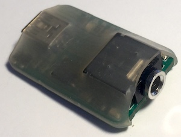

# morse-keyer

A web-interface for a Morse Code keyer.  The plan is to implement all the features of the [Curtis
Keyer](http://www.arrl.org/news/curtis-keyer-chip-developer-jack-curtis-k6ku-sk) as well as some
other experimental options.  See the [extensive product manual](./docs/CK-8045ABM.pdf) for more
information.

Brad Mitchell's [History of Curtis Keyers](./docs/curtis-qst-aug-2016.png) appeared in the August
2016 edition of QST magazine.  He also posted this YouTube video about it here:

[](https://www.youtube.com/watch?v=HjsUctIE3-I)

The interface is using the keyboard (or virtual keyboard) right and left control keys.  See the [Ham
Radio Solutions USB interface](https://hamradio.solutions/vband/) to use a key or paddle to emulate
a keyboard (click on the Store tab).



# Keyer Features (not all yet implemented)

Here's a quick explanation of some of the keyer features.

- Tone generator - vary frequency from 400 to 1200 Hz (600 default).
- Straight key mode - for manually keying every dot and dash.
- Paddle mode - one key (usually left) sends an automatic string of dots and the other a string of
  dashes.
- Iabmic paddles - When pressing both keys - sends an alternating string of dots and dashes.
- A and B modes - A (default) will stop sending when both paddles are released.  B mode, will send
  one additional symbol to complete the character.
- Dot to dash ratio - 1:3 is standard, but can be varied (for some improved readabilty at higher
  speeds).
- Speed meter - this was present in Curtis keyers - need some research to describe.
- Dot and Dash memory - this is a "look ahead" - so you can press the next symbol while
  the current one is playing; and even though you release the paddles it will send that next
  symbol (e.g., quickly press right-left and an N (dah-dit) will be sent).
- Keyer memories - record a sequence to be played later.  This includes the insertion of
  counters in the middle of the key stream of contesting.
- Rise time control - Limit the bandwidth of tone generator by easing in the rise time of the
  generated tones.
- Character decoder - display decoded letters as they are sent.
- Sending analyzer - show statistics of accuracy of code sending (v.s. standard symbol length and
  character and word spacing).

# Hardware Implementation

See also a related [circuit simulation](https://circuitverse.org/users/155805/projects/morse-keyer)
of a simple keyer.

# Morse Code Character Set

A &rightarrow; &sdot;&minus;
<br>C &rightarrow; &minus;&sdot;&minus;&sdot;
<br><span style="text-decoration: overline">AR</span> &rightarrow; &sdot;&minus;&sdot;&minus;&sdot;

# Using this Repo

```
$ npm install
$ npm run build
$ npm test
$ npm run coverage   # For code coverage and performance tracking.
```

I find it convenient to use `npm run watch` to compile source files
incrementally as they are modified and saved.
